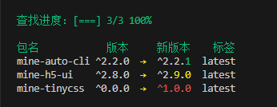

# mine-auto-cli

一个将多个命令简化成一个命令的工具 😆

<h2 align="center">
  <a href="https://www.npmjs.com/package/mine-auto-cli"></a>
  <a href="https://www.npmjs.com/package/mine-auto-cli"></a>
  <a href="https://www.npmjs.com/package/mine-auto-cli"></a>
  <a href="https://github.com/biaov/mine-auto-cli/blob/main/LICENSE"></a>
</h2>

## 特性

- [x] [初始化配置文件](#初始化配置文件)
- [x] [简化 `Git` 提交命令](#简化-git-提交命令)
- [x] [简化打包提交命令](#简化打包提交命令)
- [x] [简化手动更改版本号命令](#简化手动更改版本号命令)
- [x] [生成工作目录结构文件](#生成工作目录结构文件)
- [x] [检查 `package.json` 依赖版本](#检查-packagejson-依赖版本)
- [x] [生成依赖注释文件](#生成依赖注释文件)

## 全局安装

```sh
npm i -g mine-auto-cli
```

## 使用

### 查看版本

```sh
auto -v
```

### 查看所有命令

```sh
auto -h
```

### 初始化配置文件

- 自动生成初始化 `auto-cli.jsonc` 文件
- 带上 `-y` 或者 `--yml` 生成 `auto-cli.yml`
- 如果两个文件都存在，则合并优先于 `auto-cli.jsonc` 文件
- 初始化的所有字段仅是默认值和可选值，可以自定义删除

```sh
auto init
```

- 字段解析：

  - `prefix`: 版本前缀，默认为 `^`
  - `registry`: 依赖来源，默认为 `https://registry.npmmirror.com/`
  - `check`: 是否更新 `package.json` 文件，为 `true` 时等同于 `auto check -u`, `-u` 优先级最高， 默认为 `false`
  - `reject`: 拒绝检查的依赖，默认为 `[]`
  - `resolve`: 指定版本检查的标签，默认为 `[]`，例如：['mine-auto-cli@beta']，默认标签为 `latest`
  - `comment`: 配置依赖解析说明预设

- auto-cli.jsonc

```json
{
  "prefix": "^",
  "registry": "https://registry.npmmirror.com/",
  "check": false,
  "reject": [],
  "resolve": [],
  "comment": {}
}
```

- auto-cli.yml

```yml
prefix: ^
registry: https://registry.npmmirror.com/
check: false
reject: []
resolve: []
comment: {}
```

### 简化 Git 提交命令

```sh
auto git [描述]
# 等同于
git add -A
git commit -m [描述]
git push
```

### 简化打包提交命令

```sh
auto build[:环境] [描述]
# 等同于
npm run build:staging
git add -A
git commit -m [描述]
git push
```

### 简化手动更改版本号命令

```sh
# 版本号自增
auto version++
# 或者指定具体的版本号
auto version@1.0.0
```

### 生成工作目录结构文件

- 可以在工作目录生成 `directory.md` 文件

```sh
auto mkdir
```

- `directory.md`

```MD
├── mine-auto-cli
│    ├── src
│    │    └── commander
└    └── README.md
```

- 通过 `-l, --line` 生成的结构文件带横线，默认数量为 `20`
- 通过 `-n, --name` 自定义生成的结构文件名称，默认名称为 `directory`

```sh
auto mkdir -l 10 -n demo
```

- `demo.md`

```MD
├── mine-auto-cli  ----------------------
│    ├── src  ---------------------------
│    │    └── commander -----------------
└    └── README.md ----------------------
```

### 检查 package.json 依赖版本

```sh
auto check
```



#### 生成依赖注释文件

- 可以在工作目录生成 `directory.md` 文件

```sh
auto comment
```

- `comment.md`
- 可以在 `auto-cli.jsonc` 配置 `comment` 用来设置预设值，不设置的话默认为空

```MD
### 依赖解析

#### dependencies

- `mine-h5-ui`:

#### devDependencies

- `mine-auto-cli`:

#### optionalDependencies

- `@rollup/rollup-linux-x64-gnu`:
```

### 技术栈

- `Vite` + `TypeScript` + `NodeJs`

### 依赖解析

#### dependencies

- `chalk`: 字体颜色
- `commander`: 命令
- `log-symbols`: 图标
- `ora`: 动画效果
- `pacote`: 包信息请求器
- `strip-json-comments`: 移除 json 注释
- `update-notifier`: 检查更新

#### devDependencies

- `@types/node`: `node` 类型
- `@types/pacote`: `pacote` 类型
- `@types/update-notifier`: `update-notifier` 类型
- `prettier`: 格式化工具
- `typescript`: 编程语言
- `vite`: 项目构建工具

## 贡献者们

[](https://github.com/biaov/mine-auto-cli/graphs/contributors)
